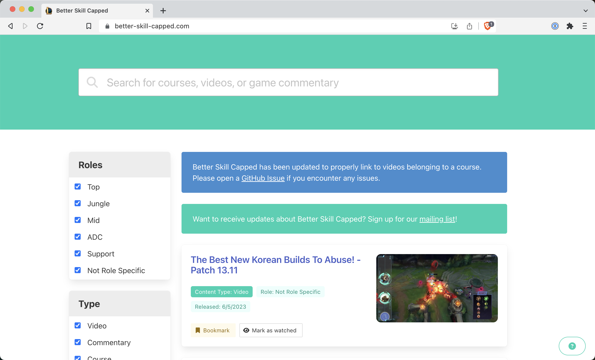

# Better Skill Capped

[Skill Capped](https://www.skill-capped.com/) has some great content, but the website leaves much to be desired. It doesn't have search functionality, the video player is minimal, and figuring out what to watch next is more difficult than it should be.

Luckily Skill Capped provides a manifest of all their video data embeded right into the HTML they serve! This is a small React app that renders the video data in a nice interface.

## Development

The easiest way to work on Better Skill Capped is with a [devcontainer](https://containers.dev/). You can do this with [GitHub Codespaces](https://codespaces.new/shepherdjerred/better-skill-capped), [VS Code Dev Containers](https://code.visualstudio.com/docs/devcontainers/containers), or [DevPod](https://devpod.sh/). My reccomendation would be DevPod, since it is free and open source, and it allows you to use any cloud provider for the underlying compute.

## Sponsors

A special thanks to [Sentry](https://sentry.io/) for sponsoring this project. Check them out!

 
